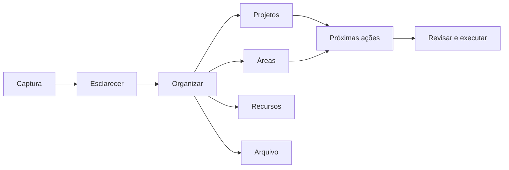
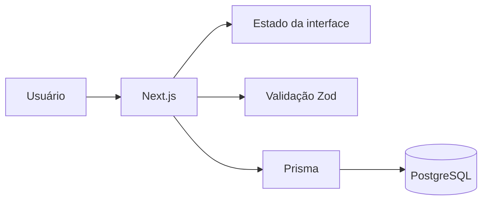

# MySys

Laboratório de sistema pessoal que combina princípios de **GTD**, **ZTD** e **PARA** em uma aplicação web.

O projeto investiga como transformar métodos de produtividade — normalmente mantidos em listas, pastas e ferramentas desconectadas — em um modelo de dados coerente para projetos, áreas, recursos, arquivos e próximas ações.

## Questão de produto

Um sistema pessoal precisa organizar informação sem aumentar o esforço necessário para mantê-la.

MySys explora três necessidades:

1. capturar rapidamente o que exige atenção;
2. dar contexto e destino ao que foi capturado;
3. permitir revisão sem esconder compromissos em estruturas complexas.

## Modelo conceitual



## Stack

**Aplicação**  
`Next.js 13` · `React 18` · `TypeScript`

**Interface e estado**  
`Tailwind CSS` · `Headless UI` · `Heroicons` · `Zustand` · `Immer` · `React DnD`

**Dados e validação**  
`Prisma` · `Vercel Postgres` · `Zod` · `CUID2`

**Documentação**  
`Mermaid` · geração de diagrama de entidades pelo Prisma

## Capacidades planejadas

- [ ] captura de tarefas e ideias;
- [ ] organização por projeto;
- [ ] organização por área de responsabilidade;
- [ ] associação a contextos;
- [ ] acompanhamento por data;
- [ ] revisão de compromissos;
- [ ] movimentação visual entre estados;
- [ ] arquivo de itens concluídos ou inativos.

## Organização arquitetural



O projeto mantém separadas três preocupações:

- **método** — as regras de organização pessoal;
- **interação** — como o usuário captura, move e revisa itens;
- **persistência** — como relações e estados são armazenados.

## Execução local

```bash
git clone https://github.com/BrunoCesarAngst/app-mysys.git
cd app-mysys
npm install
cp .env.example .env
npm run generate
npm run dev
```

Aplicação: `http://localhost:3000`

## Banco de dados

```bash
npm run migration
npm run prisma
npm run studio
```

## Estado do projeto

**Conceito em desenvolvimento.**

O repositório registra uma exploração arquitetural e não deve ser interpretado como produto concluído. As funcionalidades planejadas permanecem explicitamente marcadas para que o estágio real do trabalho não seja confundido com uma entrega pronta.

## O que este projeto demonstra

- transformação de métodos abstratos em entidades e relações;
- preocupação com fricção de uso e revisão;
- modelagem de estado para interação visual;
- persistência relacional com schema versionado;
- documentação visual de domínio;
- transparência sobre escopo concluído e planejado.

---

[Perfil de Bruno César Angst](https://github.com/BrunoCesarAngst) · [Site](https://brunoangst.com.br/)
